# Academic Diagram Generator

**Inspired by PaperBanana (Zhu et al., 2026) — NeurIPS publication-quality illustrations from text.**

## What This Skill Does

Transforms methodology descriptions into publication-ready academic illustrations using a 5-agent pipeline with iterative refinement. Outputs code (SVG, Chart.js, Mermaid) that renders vector graphics suitable for top-tier conferences (NeurIPS, ICML, CVPR).

**Key insight from PaperBanana:** "Randomly selected examples work nearly as well as semantically matched ones. What matters is showing the model what good diagrams look like."

## Supported Output Types

| Type | Format | Best For |
|------|--------|----------|
| **Methodology Diagrams** | SVG | Framework overviews, pipelines, architecture |
| **Statistical Plots** | Chart.js HTML | Bar charts, line charts, heatmaps |
| **Tables** | HTML/Markdown | Results, comparisons, ablations |
| **Pseudocode** | ASCII/Unicode | Algorithms, mathematical notation |
| **Flowcharts** | Mermaid | Simple pipelines (GitHub-native) |

---

## Quick Start

**Invoke the skill:**
```
/academic-diagram
```

**Then provide:**
1. **Methodology text** — paste your method section or describe the approach
2. **Caption** — "Overview of our framework" or "Training pipeline"
3. **Diagram type** — Framework / Pipeline / Module / Statistical

**Example:**
```
/academic-diagram

Methodology: Our model consists of three stages: (1) a BERT encoder that
processes input tokens, (2) a cross-attention layer that fuses visual and
textual features, and (3) a classification head with softmax output.

Caption: Overview of our multimodal fusion architecture.

Type: Framework diagram
```

---

## The 5-Agent Pipeline

This skill implements the PaperBanana agentic framework:

```
┌─────────────────────────────────────────────────────────────┐
│                    LINEAR PLANNING PHASE                     │
│                                                              │
│   ┌──────────┐     ┌──────────┐     ┌──────────┐           │
│   │ RETRIEVER│ ──► │ PLANNER  │ ──► │ STYLIST  │           │
│   │(examples)│     │(describe)│     │(aesthetic)│           │
│   └──────────┘     └──────────┘     └──────────┘           │
│                                                              │
└─────────────────────────────────────────────────────────────┘
                              │
                              ▼
┌─────────────────────────────────────────────────────────────┐
│              ITERATIVE REFINEMENT LOOP (T=3)                │
│                                                              │
│   ┌──────────┐              ┌──────────┐                    │
│   │VISUALIZER│ ◄──────────► │  CRITIC  │                    │
│   │(SVG/code)│    refine    │(evaluate)│                    │
│   └──────────┘              └──────────┘                    │
│                                                              │
│   Round 1 → Round 2 → Round 3 → Final Output                │
│                                                              │
└─────────────────────────────────────────────────────────────┘
```

---

## Phase 1: Linear Planning

### Agent 1: Retriever

**Purpose:** Match the request to a reference pattern (by STRUCTURE, not topic).

**Categories:**
1. **Agent & Reasoning** — LLM agents, multi-agent systems, tool use, chain-of-thought
2. **Vision & Perception** — Computer vision, 3D, detection, segmentation
3. **Generative & Learning** — Diffusion, GANs, RL, optimization
4. **Science & Applications** — AI4Science, graphs, domain-specific

**Matching Rule:** Prioritize visual structure over research topic.
- "Framework overview" → Framework pattern (regardless of domain)
- "Training pipeline" → Pipeline pattern
- "Module detail" → Zoomed breakout pattern

### Agent 2: Planner

**Purpose:** Translate methodology text into detailed visual description.

**Output Format:**
```
DIAGRAM DESCRIPTION:
1. LAYOUT: [left-to-right flow / top-to-bottom / circular / grid]
2. MAIN REGIONS: [list colored containers with labels]
3. COMPONENTS: [for each component: shape, label, position, connections]
4. CONNECTIONS: [for each arrow: source, target, style, label]
5. DATA FLOW: [describe the logical flow path]
6. SPECIAL ELEMENTS: [icons, mathematical notation, examples]
```

**Planner Rules:**
- Include ALL raw data points for statistical plots
- Specify exact positions and connections
- Use structured shorthand, not prose
- Enumerate every element that must appear

### Agent 3: Stylist

**Purpose:** Apply NeurIPS aesthetic guidelines to the description.

**Style Application:**
- Select color palette from approved options
- Specify font families (Sans-serif labels, Serif math)
- Define line styles (solid=data, dashed=auxiliary)
- Set shape parameters (corner radius, borders)

---

## Phase 2: Iterative Refinement

### Agent 4: Visualizer

**Purpose:** Convert styled description into executable code (SVG/Chart.js/Mermaid).

**Output:** Complete, self-contained code that renders the diagram.

### Agent 5: Critic

**Purpose:** Evaluate the generated diagram and propose refinements.

**Evaluation Dimensions:**
1. **Faithfulness** — Does it match the methodology?
2. **Conciseness** — Is it visually clean (signal-to-noise)?
3. **Readability** — Is the flow clear and text legible?
4. **Aesthetics** — Does it meet publication standards?

**Critic Output:**
```
EVALUATION:
- Faithfulness: [PASS/FAIL] — [reasoning]
- Conciseness: [PASS/FAIL] — [reasoning]
- Readability: [PASS/FAIL] — [reasoning]
- Aesthetics: [PASS/FAIL] — [reasoning]

ISSUES FOUND:
1. [specific issue and location]
2. [specific issue and location]

REFINEMENT:
[revised description addressing issues]
```

**Loop:** Visualizer → Critic → Visualizer → Critic → Visualizer → Final

---

## NeurIPS 2025 Style Guide

**The "Soft Tech & Scientific Pastels" Aesthetic**

### Color Palettes

**Background Fills (for containers/stages):**
| Color | Hex | Use Case |
|-------|-----|----------|
| Cream/Beige | `#F5F5DC` | Warm, academic feel |
| Pale Blue | `#E6F3FF` | Clean, technical feel |
| Mint/Sage | `#E0F2F1` | Soft, organic feel |
| Pale Lavender | `#F3E5F5` | Distinctive, modern feel |
| White | `#FFFFFF` | Minimalist (with dashed borders) |

**Functional Elements:**
| Status | Colors | Examples |
|--------|--------|----------|
| Trainable/Active | Warm tones | `#FF6B6B`, `#FFA07A`, `#FF69B4` |
| Frozen/Static | Cool tones | `#A9A9A9`, `#87CEEB`, `#00CED1` |
| Highlights/Results | High saturation | `#FF4444`, `#FFD700` |

**Recommended Pairings:**
- Blue `#4A90D9` + Orange `#F5A623`
- Teal `#26A69A` + Pink `#EC407A`
- Green `#66BB6A` + Purple `#AB47BC`

### Shapes & Containers

| Element | Shape | Style |
|---------|-------|-------|
| Process/Layer | Rounded Rectangle | Corner radius 8-12px |
| Tensor/Data | 3D Stack/Cuboid | Shows dimensionality |
| Matrix/Tokens | Flat Grid | Square cells |
| Database/Memory | Cylinder | Vertical orientation |
| Decision | Diamond | For branching logic |

**Borders:**
- Solid: Physical components
- Dashed: Logical stages, optional paths, scopes

### Lines & Arrows

| Line Style | Meaning |
|------------|---------|
| Solid black/grey | Data flow (forward pass) |
| Dashed | Auxiliary flow (gradients, skip connections) |
| Orthogonal/Elbow | Architecture diagrams |
| Curved/Bezier | System logic, feedback loops |

**Operators on lines:** `⊕` (Add), `⊗` (Concat/Multiply)

### Typography

| Element | Font | Style |
|---------|------|-------|
| Labels | Sans-serif (Arial, Helvetica) | Bold for headers, Regular for details |
| Variables | Serif (Times) | Italic: `x`, `θ`, `𝓛` |
| Math | LaTeX-style | Proper subscripts, Greek letters |

### Icons (Domain-Specific)

**For Model State:**
- Trainable: 🔥 Fire, ⚡ Lightning
- Frozen: ❄️ Snowflake, 🔒 Padlock

**For Operations:**
- Inspection: 🔍 Magnifying glass
- Processing: ⚙️ Gear

**For Content:**
- Text/Prompt: 📄 Document, 💬 Chat bubble
- Image: Actual thumbnail

---

## Reference Patterns

### Pattern 1: Framework Overview (Agent & Reasoning)

**Visual Structure:**
- Horizontal flow (left → right)
- 2-3 colored containers for phases
- Robot/agent icons with accessories
- Chat bubbles for prompts
- Document icons for retrieval

**Example Layout:**
```
┌─────────────────────────────────────────────────────────┐
│ [Input Icons]  →  [Processing Container]  →  [Output]   │
│                                                          │
│  📄 Context      ┌─────────────────────┐    📊 Result   │
│  💬 Query    →   │  🤖 Agent Module    │  →             │
│                  │  [sub-components]   │                 │
│                  └─────────────────────┘                 │
└─────────────────────────────────────────────────────────┘
```

### Pattern 2: Architecture Diagram (Vision & Perception)

**Visual Structure:**
- Vertical or mixed flow
- 3D tensor representations
- Frustums (camera cones) for vision
- Heatmaps with Viridis colormap
- RGB color coding for axes

**Example Layout:**
```
     ┌─────────┐
     │ Input   │ (Image with 3D stack)
     └────┬────┘
          │
    ┌─────▼─────┐
    │ Encoder   │ (3D feature cube)
    └─────┬─────┘
          │
    ┌─────▼─────┐
    │ Decoder   │
    └─────┬─────┘
          │
     ┌────▼────┐
     │ Output  │
     └─────────┘
```

### Pattern 3: Training Pipeline (Generative & Learning)

**Visual Structure:**
- Clear data flow arrows
- Loss connections (dashed, red)
- Gradient paths marked
- Iteration/loop indicators

### Pattern 4: Theoretical/Minimalist (Science & Applications)

**Visual Structure:**
- Sparse, abstract
- Graph nodes (circles)
- Manifolds (planes/surfaces)
- Mostly grayscale + one highlight color
- Mathematical notation prominent

---

## Evaluation Rubrics

### Faithfulness (Content Accuracy)

**PASS if:**
- All core components from methodology are present
- Logical flow matches described method
- No hallucinated modules or connections
- Caption scope is respected

**VETO (immediate fail):**
- Major hallucination (invented components)
- Logical contradiction (reversed flow)
- Scope violation (doesn't match caption)
- Gibberish text or broken notation

### Conciseness (Visual Signal-to-Noise)

**PASS if:**
- High-level abstraction (not text dump)
- Keywords instead of full sentences
- Clean blocks and arrows
- No redundant elements

**VETO (immediate fail):**
- Textual overload (>15 words in boxes)
- Literal copy-paste from method text
- Math dump (raw equations everywhere)

### Readability (Information Extraction)

**PASS if:**
- Clear visual flow at a glance
- Legible text (appropriate size)
- No overlapping elements
- Consistent font sizes

**VETO (immediate fail):**
- Caption text inside image pixels
- Occluded/overlapping labels
- Spaghetti arrow routing
- Low contrast (light on light)

### Aesthetics (Publication Quality)

**PASS if:**
- Harmonious color scheme
- Professional, modern look
- Consistent styling throughout
- Appropriate for top-tier venue

**VETO (immediate fail):**
- Background grids visible (draw.io artifact)
- Neon/jarring colors
- Black background
- Distorted/blurry elements

---

## Output Templates

### SVG Template (Methodology Diagram)

**IMPORTANT: Always wrap SVG in complete HTML for immediate browser viewing.**

```html
<!DOCTYPE html>
<html lang="en">
<head>
    <meta charset="UTF-8">
    <meta name="viewport" content="width=device-width, initial-scale=1.0">
    <title>Diagram Title</title>
    <style>
        body {
            margin: 0;
            padding: 20px;
            background: #f8f9fa;
            display: flex;
            justify-content: center;
            align-items: center;
            min-height: 100vh;
            font-family: Arial, sans-serif;
        }
        .container {
            background: white;
            padding: 20px;
            border-radius: 8px;
            box-shadow: 0 2px 10px rgba(0,0,0,0.1);
        }
        svg {
            display: block;
            max-width: 100%;
            height: auto;
        }
    </style>
</head>
<body>
    <div class="container">
        <svg xmlns="http://www.w3.org/2000/svg" viewBox="0 0 800 400">
  <defs>
    <!-- Gradient for containers -->
    <linearGradient id="containerGrad" x1="0%" y1="0%" x2="0%" y2="100%">
      <stop offset="0%" style="stop-color:#E6F3FF;stop-opacity:1" />
      <stop offset="100%" style="stop-color:#CCE5FF;stop-opacity:1" />
    </linearGradient>

    <!-- Arrow marker -->
    <marker id="arrowhead" markerWidth="10" markerHeight="7"
            refX="9" refY="3.5" orient="auto">
      <polygon points="0 0, 10 3.5, 0 7" fill="#333"/>
    </marker>

    <!-- Dashed arrow marker -->
    <marker id="arrowhead-dashed" markerWidth="10" markerHeight="7"
            refX="9" refY="3.5" orient="auto">
      <polygon points="0 0, 10 3.5, 0 7" fill="#888"/>
    </marker>
  </defs>

  <!-- Background -->
  <rect width="800" height="400" fill="#FFFFFF"/>

  <!-- Container example -->
  <rect x="50" y="50" width="200" height="300" rx="12" ry="12"
        fill="url(#containerGrad)" stroke="#4A90D9" stroke-width="2"/>

  <!-- Container label -->
  <text x="150" y="80" text-anchor="middle"
        font-family="Arial, sans-serif" font-size="14" font-weight="bold"
        fill="#333">Phase 1</text>

  <!-- Module box -->
  <rect x="70" y="100" width="160" height="60" rx="8" ry="8"
        fill="#4A90D9" stroke="#2E5A8C" stroke-width="1.5"/>
  <text x="150" y="135" text-anchor="middle"
        font-family="Arial, sans-serif" font-size="12" fill="#FFF">
    Encoder
  </text>

  <!-- Math variable (serif, italic) -->
  <text x="150" y="155" text-anchor="middle"
        font-family="Times New Roman, serif" font-size="11"
        font-style="italic" fill="#FFF">
    f(x) → z
  </text>

  <!-- Data flow arrow -->
  <line x1="250" y1="200" x2="350" y2="200"
        stroke="#333" stroke-width="2" marker-end="url(#arrowhead)"/>

  <!-- Auxiliary flow (dashed) -->
  <line x1="400" y1="300" x2="100" y2="300"
        stroke="#888" stroke-width="1.5" stroke-dasharray="5,5"
        marker-end="url(#arrowhead-dashed)"/>
  <text x="250" y="290" text-anchor="middle"
        font-family="Arial, sans-serif" font-size="10" fill="#888">
    gradient
  </text>
        </svg>
    </div>
</body>
</html>
```

### Chart.js Template (Statistical Plot)

```html
<!DOCTYPE html>
<html>
<head>
  <script src="https://cdn.jsdelivr.net/npm/chart.js"></script>
  <style>
    body { font-family: Arial, sans-serif; padding: 20px; }
    .chart-container { max-width: 600px; margin: 0 auto; }
  </style>
</head>
<body>
  <div class="chart-container">
    <canvas id="chart"></canvas>
  </div>
  <script>
    const ctx = document.getElementById('chart').getContext('2d');
    new Chart(ctx, {
      type: 'bar',
      data: {
        labels: ['Method A', 'Method B', 'Ours'],
        datasets: [{
          label: 'Accuracy (%)',
          data: [85.2, 87.4, 92.1],
          backgroundColor: [
            'rgba(74, 144, 217, 0.7)',
            'rgba(102, 187, 106, 0.7)',
            'rgba(255, 107, 107, 0.7)'
          ],
          borderColor: [
            'rgba(74, 144, 217, 1)',
            'rgba(102, 187, 106, 1)',
            'rgba(255, 107, 107, 1)'
          ],
          borderWidth: 2
        }]
      },
      options: {
        responsive: true,
        plugins: {
          title: {
            display: true,
            text: 'Performance Comparison',
            font: { size: 16, weight: 'bold' }
          },
          legend: { display: false }
        },
        scales: {
          y: {
            beginAtZero: false,
            min: 80,
            title: { display: true, text: 'Accuracy (%)' }
          }
        }
      }
    });
  </script>
</body>
</html>
```

### Mermaid Template (Flowchart)

```mermaid
%%{init: {'theme': 'neutral', 'themeVariables': {
  'primaryColor': '#E6F3FF',
  'primaryBorderColor': '#4A90D9',
  'lineColor': '#333',
  'fontFamily': 'Arial'
}}}%%

flowchart LR
    subgraph Input["📥 Input"]
        A[Text]
        B[Image]
    end

    subgraph Process["⚙️ Processing"]
        C[Encoder]
        D[Fusion]
        E[Decoder]
    end

    subgraph Output["📤 Output"]
        F[Prediction]
    end

    A --> C
    B --> C
    C --> D
    D --> E
    E --> F

    style Input fill:#E6F3FF,stroke:#4A90D9
    style Process fill:#E0F2F1,stroke:#26A69A
    style Output fill:#F3E5F5,stroke:#AB47BC
```



---

## Execution Protocol

When `/academic-diagram` is invoked:

### Step 1: Gather Input
```
Please provide:
1. METHODOLOGY: [paste your method section or describe the approach]
2. CAPTION: [what should this diagram show?]
3. TYPE: [Framework / Pipeline / Module / Statistical / Table / Pseudocode]
4. FORMAT: [SVG (default) / Chart.js / Mermaid / ASCII]
```

### Step 2: Retriever Analysis
Identify the best-matching pattern category:
- Agent & Reasoning → illustrative, friendly style
- Vision & Perception → spatial, geometric style
- Generative & Learning → flow-focused style
- Science & Applications → minimalist, abstract style

### Step 3: Planner Output
Generate structured description with:
- Exact layout specification
- All components listed with positions
- All connections with styles
- Data points (for statistical plots)

### Step 4: Stylist Refinement
Apply NeurIPS aesthetic guidelines:
- Select color palette
- Define typography
- Specify shapes and lines

### Step 5: Visualizer Generation (Round 1)
Generate complete code (SVG/Chart.js/Mermaid)

### Step 6: Critic Evaluation
Assess against 4 dimensions:
- Faithfulness
- Conciseness
- Readability
- Aesthetics

### Step 7: Refinement Loop (Rounds 2-3)
If issues found:
1. Identify specific problems
2. Generate refined description
3. Re-visualize
4. Re-evaluate

### Step 8: Final Output
Present:
1. **Complete HTML file** (ALWAYS wrap SVG in HTML — never output raw SVG)
2. Save instructions (filename suggestion)
3. The HTML file should be self-contained and immediately viewable in any browser

**CRITICAL RULE:** All diagram outputs MUST be complete, self-contained HTML files that can be saved and opened directly in a browser. Never output raw SVG code alone.

---

## Common Pitfalls to Avoid

### The "PowerPoint Default" Look
❌ Standard blue/orange presets with heavy black outlines
✅ Soft pastels with subtle borders

### The "Text Dump"
❌ Full sentences in every box
✅ Keywords and icons with clear arrows

### The "Spaghetti Diagram"
❌ Arrows crossing everywhere with no logic
✅ Orthogonal routing with clear data flow

### The "Excel Chart"
❌ 3D effects, shadows, serif fonts
✅ Clean 2D, sans-serif, muted colors

### The "Rainbow Heatmap"
❌ Jet/Rainbow colormap
✅ Viridis, Magma, or Coolwarm (perceptually uniform)

---

## Tips for Best Results

1. **Be specific in your methodology description** — The more detail, the better the diagram
2. **Include exact data points for plots** — Don't say "around 85%", say "85.2%"
3. **Specify the caption/intent clearly** — "Overview" vs "Detailed module" produces very different outputs
4. **Request refinements explicitly** — "Make the arrows more prominent" or "Use warmer colors"
5. **Iterate** — The 3-round loop is there for a reason; use it

---

## Example Session

**User:**
```
/academic-diagram

Methodology: PaperBanana orchestrates five specialized agents:
1. Retriever - finds relevant reference diagrams
2. Planner - translates methodology into visual description
3. Stylist - applies aesthetic guidelines
4. Visualizer - generates the image
5. Critic - evaluates and refines

Caption: Overview of the PaperBanana framework

Type: Framework diagram
Format: SVG
```

**Claude Response:**

*[Retriever Analysis]*
Category: Agent & Reasoning
Pattern: Framework overview with agent icons
Style: Illustrative, friendly, cartoon-like robots

*[Planner Output]*
```
DIAGRAM DESCRIPTION:
1. LAYOUT: Horizontal left-to-right flow
2. MAIN REGIONS:
   - "Linear Planning Phase" (pale blue container, left)
   - "Iterative Refinement Loop" (pale orange container, right)
3. COMPONENTS:
   - Input icons (document, target) at far left
   - Retriever agent (robot + magnifying glass)
   - Planner agent (robot + clipboard)
   - Stylist agent (robot + palette)
   - Visualizer agent (robot + canvas)
   - Critic agent (robot + checklist)
   - Output (polished illustration)
4. CONNECTIONS:
   - Solid arrows between agents (data flow)
   - Dashed arrow from Critic back to Visualizer (refinement loop)
   - "T=3 rounds" label on loop
5. DATA FLOW: Input → Retriever → Planner → Stylist → Visualizer ↔ Critic → Output
```

*[Generating SVG...]*

```svg
<svg xmlns="http://www.w3.org/2000/svg" viewBox="0 0 900 350">
  <!-- [Full SVG code here] -->
</svg>
```

*[Critic Evaluation - Round 1]*
- Faithfulness: PASS — All 5 agents present
- Conciseness: PASS — Clean icons, no text overload
- Readability: PASS — Clear left-to-right flow
- Aesthetics: PASS — NeurIPS-compliant colors

**Final output ready. Save as `.svg` and open in browser to view.**

---

*Skill version: 1.0.0 | Inspired by PaperBanana (Zhu et al., 2026)*
